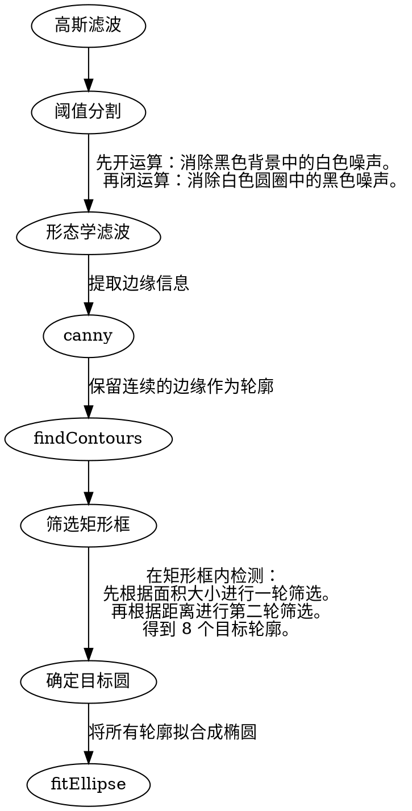

# 项目背景

本次测试中所用靶标为平面贴纸形状，每个靶标上均有八个追踪点。由八个追踪点的相对位置关系，可唯一确定靶标 id。测试过程中，双目内窥镜捕捉靶标图像，自动识别：__靶标 id，及靶标坐标系在相机坐标系下的位姿。__


<font color="red">总共可以有 64 种 id。
下方的五个圆圈用于确定x轴和y轴。</font>

e.g.
|id|000|123|
|---|---|---|
|marker|||

# 算法流程



```c++ {.line-numbers}
bool findCoordinateX(vector<point2f> points) {
    for (const auto& a:points) {
        for (const auto& b:points) {
            for (const auto& c:points) {
                if () {  // 条件1：{向量ab}=={向量bc}
                    continue;
                }
                if () {  // 条件2：其余所有点均位于{向量ac}的逆时针方向
                    continue;
                }
                if () {  // 条件3：a的最大夹角==c的最小夹角，记为θ
                    continue;
                }
                if () {  // 条件4：c在θ方向上只有1个点
                    continue;
                }
                if () {  // 条件5：a,b在θ方向上有等距的2个点
                    continue;
                }
                return true;
            }
        }
    }
    return false;
}
```
